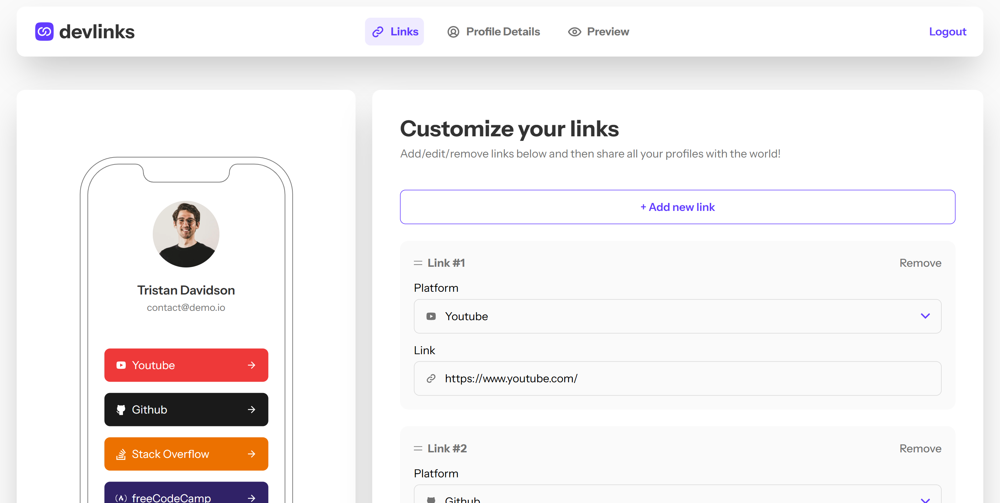

# Link-sharing app solution

This is a solution to the [Link-sharing app challenge on Frontend Mentor](https://www.frontendmentor.io/challenges/linksharing-app-Fbt7yweGsT). 

## Table of contents

- [Overview](#overview)
  - [The challenge](#the-challenge)
  - [Screenshot](#screenshot)
  - [Links](#links)
- [My process](#my-process)
  - [Built with](#built-with)
  - [What I learned](#what-i-learned)
  - [Continued development](#continued-development)
  - [Useful resources](#useful-resources)
- [Author](#author)

## Overview

### The challenge

Users can:

- Create, read, update, delete links and see previews in the mobile mockup
- Receive validations if the links form is submitted without a URL or with the wrong URL pattern for the platform
- Drag and drop links to reorder them
- Add profile details like profile picture, first name, last name, and email
- Receive validations if the profile details form is saved with no first or last name
- Preview their devlinks profile and copy the link to their clipboard
- View the optimal layout for the interface depending on their device's screen size
- See hover and focus states for all interactive elements on the page
- Save details to a database (build the project as a full-stack app)
- Create an account and log in (add user authentication to the full-stack app)

### Screenshot



### Links

- Solution URL: [Add solution URL here](https://your-solution-url.com)
- Live Site URL: [Add live site URL here](https://your-live-site-url.com)

## My process

### Built with

- Semantic HTML5 markup
- CSS custom properties
- Flexbox
- CSS Grid
- Mobile-first workflow
- [React](https://reactjs.org/) - JS library
- [Next.js](https://nextjs.org/) - React framework
- [React-Query](https://tanstack.com/query/latest) - Data fetching library
- [TailwindCSS](https://tailwindcss.com/) - For styles
- [DnD kit](https://dndkit.com/) - Drag & drop toolkit for react
- [Supabase](https://supabase.com/) - Baas Software
- [Drizzle](https://orm.drizzle.team/) - ORM Library
- [Cloudinary](https://cloudinary.com/) - Asset Storage
- [ZOD](https://zod.dev/) - Validation library


### What I learned

#### Image previews and uploads with cloudinary
This was the first project where I had to handle image files, render a preview of them, then store them in a database when saved.

First I had to create some validation to check to see if the image size was between the acceptable sizes, then render a preview of the image on the client side. When the save button is pressed, I then sent the image to be stored in cloudinary, I received back a URL which pointed to the image being stored at cloudinary. I stored this URL in the database, along with the other parts of the data. When I needed to render the image, I fetched the URL back from the database, then rendered it on the frontend.

**Heres how I handled validating & rendering the preview**

```js
  const [currentUpload, setCurrentUpload] = useState<string | null>(null); // Used "currentUpload" to render the image

  const [isImageDimensionsInvalid, setIsImageDimensionsInvalid] =
    useState(false);
  //
  const handleSetFileState = (e: FileList) => {
    if (!e) return;
    const reader = new FileReader();

    // When the file is read, it's then stored in the state to be used & rendered
    reader.onload = () => {
      setCurrentUpload(
        typeof reader.result === "string" ? reader.result : null
      );
    };

    // Hnadles the error if their is one.
    reader.onerror = function (event) {
      if (event.target) {
        console.log("Error reading file:", event.target.error);
      }
      return;
    };

    reader.readAsDataURL(e[0]); // Converts file to correct format (Base64 string).
  };
  //
  const handleCheckImageUploadSize = (e: ChangeEvent<HTMLInputElement>) => {
    const file = e.currentTarget?.files;
    if (!file) return;
    //
    const img = new Image(); // 
    img.src = window.URL.createObjectURL(file[0]); // Formats file from the list of files into object URL
    img.onload = () => {
      if (img.naturalHeight > 1024 || img.naturalWidth > 1024) {
        setIsImageDimensionsInvalid(true);
        window.URL.revokeObjectURL(img.src); // removes Reference of Object URL from the browser.
        return;
      }
      setIsImageDimensionsInvalid(false);
      window.URL.revokeObjectURL(img.src); // removes Reference of Object URL from the browser.
      handleSetFileState(file); // Function to render the preview
    };
  };
```

**This is the code I used in the sever action to upload the image to cloudinary and recieved the URL back to store in the database**

```js
  const imageFile = formData.get("imageFile") as File | null;

  // Send image to cloudinary, get url back
  let savedImageUrl: string | null = null;

  if (imageFile && imageFile.size > 0) {
    const supabase = await createClient();
    const {
      data: { user },
    } = await supabase.auth.getUser();
    if (!user) return;
    const arrayBuffer = await imageFile.arrayBuffer();
    const buffer = new Uint8Array(arrayBuffer);
    const res = await new Promise((resolve) => {
      cloudinary.uploader
        .upload_stream(
          {
            public_id: `${user.id}--avatar`,
            overwrite: true,
            invalidate: true,
          },
          function (error, result) {
            if (error) {
              console.error("Cloudinary Error:", error);
              // Resolve with an error object, to prevent fatal error
              resolve("ERROR");
              return;
            }

            resolve(result?.secure_url || null);
          }
        )
        .end(buffer);
    });
    if (res === "ERROR") return
    savedImageUrl = res as string
  }

  // Save url in with profile details
  const newDetails = {
    firstName,
    lastName,
    userEmail,
    profilePicture: savedImageUrl ? savedImageUrl : undefined,
  };
```


#### React-Query

I also used the library "React-Query" for the first time in this project and I used it to pre-fetch the data in the sever components to have the data readily available on the server. 

React-Query allows us to store this data in a cache, which we can use & mutate locally on the client. We can fetch this cached data anywhere in our application, which helps us avoid prop drilling while also not making any additional network requests when fetching the cached data. I thought this would be a better solution than using the react Context API, as we can only fetch the initial data on the app when it initially mounts. The save button would then send & store the updated local data to the backend to be stored in the database.

**Heres how we initialized the react-query client and made sure it worked on the server-side**

```js
"use client";
import { ReactNode } from "react";
import {
  isServer,
  QueryClient,
  QueryClientProvider,
} from "@tanstack/react-query";
import { ReactQueryDevtools } from "@tanstack/react-query-devtools";

function makeQueryClient() {
  return new QueryClient({
    defaultOptions: {
      queries: {
        // With SSR, we usually want to set some default staleTime
        // above 0 to avoid refetching immediately on the client
        staleTime: 60 * 1000,
      },
    },
  });
}

let browserQueryClient: QueryClient | undefined = undefined;

export function getQueryClient() {
  if (isServer) {
    // Server: always make a new query client
    return makeQueryClient();
  } else {
    // Browser: make a new query client if we don't already have one
    // This is very important, so we don't re-make a new client if React
    // suspends during the initial render. This may not be needed if we
    // have a suspense boundary BELOW the creation of the query client
    if (!browserQueryClient) browserQueryClient = makeQueryClient();
    return browserQueryClient;
  }
}

export default function Providers({ children }: { children: ReactNode }) {
  // NOTE: Avoid useState when initializing the query client if you don't
  //       have a suspense boundary between this and the code that may
  //       suspend because React will throw away the client on the initial
  //       render if it suspends and there is no boundary
  const queryClient = getQueryClient();

  return (
    <QueryClientProvider client={queryClient}>
      {children}
      <ReactQueryDevtools initialIsOpen={true} />
    </QueryClientProvider>
  );
}
```

**This is the file I used to pre-fetch the data and make that initial data available through the context**

```js
import {
  dehydrate,
  HydrationBoundary,
  QueryClient,
} from "@tanstack/react-query";
import { fetchLinks, fetchProfileDetails } from "@/query/queryFunctions";
import { PropsWithChildren } from "react";

const HydrateComps = async ({ children }: PropsWithChildren) => {
  const queryClient = new QueryClient();
  await queryClient.prefetchQuery({
    queryKey: ["links"],
    queryFn: fetchLinks,
  });
  //
  await queryClient.prefetchQuery({
    queryKey: ["profile"],
    queryFn: fetchProfileDetails,
  })
  //
  return (
    <HydrationBoundary state={dehydrate(queryClient)}>
      {children}
    </HydrationBoundary>
  );
};

export default HydrateComps;
```

**I then wrapped the app with the providers so that data would be available throughout the application**

```js
export default function RootLayout({
  children,
}: Readonly<{
  children: React.ReactNode;
}>) {
  return (
    <html lang="en" className={`${instrumentSans.variable}`}>
      <body className={`font-instrumentSans bg-lightGrey`}>
        <Providers>
          <AppProvider>
            <HydrateComps>
              <div className="w-full flex flex-col min-h-[100svh] max-w-maxBodyWidth mx-auto">
                <Navbar />
                <main className="w-full flex flex-row-reverse gap-6 flex-grow-[1] p-4 lgMob:p-6">
                  {children}
                  <MobilePreviewSection />
                </main>
              </div>
              <Toaster/>
            </HydrateComps>
          </AppProvider>
        </Providers>
      </body>
    </html>
  );
}
```

**We could then fetch the cached data and mutate it anywhere in our application**

```js
  const queryClient = useQueryClient();
  //
  const { data, isSuccess } = useQuery({
    queryKey: ["links"],
    queryFn: () => fetchLinks(),
    // staleTime: Infinity,
  });
  //
  const handleAddNew = () => {
    if (!currentUserId) return;
    // //
    queryClient.setQueryData(["links"], (links: LinksDetails[]) => {
      return [
        ...links,
        {
          id: uuidv4(),
          url: "",
          userId: currentUserId,
          orderNumber: links.length + 1,
          platformId: linkOptions[0].id,
          platformValue: linkOptions[0].value,
          platformLabel: linkOptions[0].label,
          platformColour: linkOptions[0].color,
        },
      ];
    });
  };
```

### Continued development

This was my first time I've built an application that handles files and uploads and this experience definitely has made me more interested in learning how to handle different types of files. In the future I want to learn more about how to handle different files, not just images, and build more complex apps that do things with a variety of different file types.

### Useful resources

- [FileReader API](https://developer.mozilla.org/en-US/docs/Web/API/FileReader) & [createObjectURL Method](https://developer.mozilla.org/en-US/docs/Web/API/URL/createObjectURL_static) - The two main things I used to display a preview image from an uploaded file image were the "FileReader" API & the "createObjectURL()" method on the "URL" API, you can find out more about them on their MDN docs pages.

- [React-Query Advanced SSR](https://tanstack.com/query/latest/docs/framework/react/guides/advanced-ssr) - I used react-query to prefetch the data in the application. This specific part of the docs helped me set it up in the context of NextJS server components and Server-side rendering.

- [Cloudinary NodeJS SDK Setup](https://cloudinary.com/documentation/node_configuration_tutorial) & [Cloudinary uploads in Nextjs server actions](https://cloudinary.com/documentation/upload_assets_with_server_actions_nextjs_tutorial) - Cloudinary was the asset library I used to store the image uploads. These two pages of the Documentation are what I used to help me set up images uploads in NextJS server components. 

- [Drizzle with Supabase setup guide](https://orm.drizzle.team/docs/tutorials/drizzle-with-supabase) - These are the docs that helped me get up & running with drizzle & supabase together.

- [Supabase with NextJS setup guide](https://supabase.com/docs/guides/getting-started/quickstarts/nextjs) - The documentation for setting up a Supabase project with NextJS

- [Youtube Video - Cosden Solutions - Authentication Flow in Next.js](https://www.youtube.com/watch?v=Otq0LY90Qso) - Before I went with using the supabase Authentication, I wanted to build it myself, remind myself of the core concepts and how to implement it in Nextjs. Although I didn't end up using it in the end because it made it awkward to use with the supabse postgres database, the video was a great help in explaining the core concepts of how to build and impliment authentication inside a Nextjs application.

## Author

- Portfolio - [www.djhwebdevelopment.com](https://www.djhwebdevelopment.com)
- Frontend Mentor - [@David-Henery4](https://www.frontendmentor.io/profile/David-Henery4)
- Github - [David-Henery4](https://github.com/David-Henery4)
- LinkedIn - [David Henery](https://www.linkedin.com/in/david-henery-725458241)


